# Cross-Community Topic Analysis on Reddit

---

## Table of Contents
- [Overview](#overview)
- [Abstract](#abstract)
- [Subreddits Analyzed](#subreddits-analyzed)
- [Pipeline](#pipeline)
  - [1. Data Collection](#1-data-collection-crawlerpy)
  - [2. Topic Modeling](#2-topic-modeling-topic_modelingpy)
  - [3. Analysis and Visualization](#3-analysis--visualization)
- [Engineering Decisions](#engineering-decisions)
- [Results](#results)
  - [Cosine Similarity Heatmap](#cosine-similarity-heatmap)
  - [Shared Topic Fraction Heatmap](#shared-topic-fraction-heatmap)
  - [Community Density Analysis (UMAP)](#community-density-analysis-umap)
  - [Word Clouds](#word-clouds)
- [Key Findings](#key-findings)
- [Setup](#setup)
- [Authors](#authors)

---

## Overview

This project analyzes discussion patterns across 15 Reddit communities to understand how different types of online communities organize around topics. We crawled roughly 1,000 posts from each subreddit, ran BERTopic for unsupervised topic modeling, used Google's Gemini (Gemma 3 27B IT) to generate human-readable topic labels, and then built out a set of cross-community analyses including cosine similarity heatmaps, shared topic matrices, per-topic word clouds, and UMAP scatter plots.

The core question driving the work: how do communities with very different purposes (finance, gaming, politics, general Q&A, etc.) end up overlapping or diverging in what they talk about?

Built by Anshuman Yadav and Tanish Mishra (https://github.com/Tan28-art)

## Abstract

Social media platforms host a variety of communities, each centered around specific interests, yet the degree to which these communities share thematic content remains underexplored. This project investigates community-level homogeneity and heterogeneity across 15 Reddit subreddits spanning 5 broad domains. We built a custom data collection pipeline to crawl posts, applied BERTopic with `all-mpnet-base-v2` embeddings for unsupervised topic discovery, and refined the resulting topic labels using Google's Gemma 3 27B IT model. We then constructed binary topic-presence matrices, computed pairwise cosine similarity between communities, and analyzed shared topic fractions. Our results show that communities with narrow, well-defined purposes (like r/Bitcoin) tend to be topically homogeneous, while broad-interest communities (like r/NoStupidQuestions) are highly heterogeneous. Cross-domain topic overlap is most common within the same interest category, though politically-charged topics (tariffs, trade policy) cross category boundaries.

## Subreddits Analyzed

We picked 15 communities that span a range of interest areas:

| Category | Subreddits |
|---|---|
| Tech / AI | r/technology, r/programming, r/ChatGPT |
| Finance / Crypto | r/wallstreetbets, r/Bitcoin, r/investing |
| News / Politics | r/worldnews, r/politics, r/europe |
| Entertainment | r/movies, r/gaming, r/nba, r/Music |
| General / Social | r/AmIOverreacting, r/NoStupidQuestions |

Each subreddit was crawled for up to 1,000 posts with at least 10 upvotes, using multiple listing strategies (top/month, top/year, hot, new, rising, best) to get a diverse sample.

The rationale behind this selection was to cover a spectrum of community types, from highly focused single-topic communities (r/Bitcoin, r/nba) to broad-interest communities where virtually any topic can come up (r/NoStupidQuestions, r/AmIOverreacting). The five domain categories let us compare within-domain vs. cross-domain topic overlap.

## Pipeline

The project has three main stages:

### 1. Data Collection (`crawler.py`)

A custom Reddit crawler that hits the public JSON endpoints (`reddit.com/r/{subreddit}/{sort}.json`). We built this instead of using PRAW (the official Python Reddit API wrapper) for a few reasons:

- **Rate limit control**: PRAW imposes its own rate limiting on top of Reddit's, which made large-scale crawling slower than necessary. By going directly to the JSON endpoints, we had more control over request pacing.
- **No authentication required**: The public `.json` endpoints don't require OAuth tokens, which simplified the setup and avoided the API quota restrictions that come with registered applications.
- **Data format flexibility**: We wanted the raw JSON response to extract specific fields (title, selftext, score, flair, created_utc) rather than working through PRAW's object model.

The crawler rotates user agents from a predefined list to avoid detection, uses exponential backoff on 429 (rate limit) responses, and deduplicates posts by ID across different sort strategies. Raw JSON goes into `data_raw/`, then gets processed into cleaned CSVs in `data_processed/` with a `combined_text` field (title + selftext concatenated), along with date, upvotes, flair, and other metadata. Finally everything gets merged into one `reddit_ALL_data.csv`.

**Key design decisions:**
- **Minimum 10 upvotes filter**: We filtered out posts with fewer than 10 upvotes to focus on content that actually got community engagement, rather than spam or very low-effort posts.
- **Multiple sort strategies**: Using top/month, top/year, hot, new, rising, and best sort orders gave us a more representative sample than any single sort would provide. Posts were deduplicated by ID after collection.
- **Combined text field**: Concatenating title and selftext into a single `combined_text` field gave BERTopic more signal to work with, since many Reddit posts have short titles but substantial body text (or vice versa).
- **Target of ~1000 posts per subreddit**: This gave us enough data for BERTopic to find meaningful clusters without making the embedding step prohibitively slow.

### 2. Topic Modeling (`topic_modeling.py`)

We use BERTopic with a modular setup where each component is configured explicitly:

- **Embeddings**: `all-mpnet-base-v2` from sentence-transformers (768-dim), run on CUDA
- **Dimensionality Reduction**: UMAP with `n_neighbors=15`, `n_components=5`, `min_dist=0.0`, cosine metric, `random_state=42` for reproducibility
- **Clustering**: HDBSCAN with `min_cluster_size=10`, euclidean metric, EOM (Excess of Mass) cluster selection method
- **Tokenization**: CountVectorizer with English stopwords removed and n-gram range (1,3)
- **Representation**: KeyBERTInspired, which picks keywords based on semantic similarity to the cluster rather than just frequency

The model gets saved to disk so we don't have to re-fit every time.

**Key engineering decisions for the modeling pipeline:**

- **Why `all-mpnet-base-v2`?** This model produces 768-dimensional embeddings and is one of the best general-purpose sentence transformers available. We tested a few options and this one gave the most coherent topic clusters for Reddit-style text, which tends to be informal and variable in length.

- **Why UMAP over alternatives like PCA or t-SNE?** UMAP preserves both local and global structure in the embedding space, which matters for clustering. PCA is linear and would miss the nonlinear relationships between topics. t-SNE is good for visualization but doesn't preserve global structure well enough for clustering. UMAP with `min_dist=0.0` creates tighter clusters, which helps HDBSCAN find more distinct groups.

- **Why HDBSCAN?** Unlike K-Means, HDBSCAN doesn't require you to specify the number of clusters in advance. This is important because we didn't know how many topics each subreddit would have. HDBSCAN also naturally handles noise (posts that don't clearly belong to any topic), which is common in social media data.

- **Why KeyBERTInspired over default c-TF-IDF?** The default BERTopic representation uses c-TF-IDF (class-based TF-IDF), which picks representative words based on frequency within vs. across topics. This often produces keyword dumps like `"0_bitcoin_btc_crypto_mining"` that are hard to interpret. KeyBERTInspired instead selects keywords based on their semantic similarity to the cluster centroid, which produces more meaningful and diverse topic names.

- **Short text filtering**: Before running BERTopic, we filtered out posts with very short `combined_text` (fewer than ~10 words). Very short posts tend to create noise in the embedding space and don't carry enough signal for meaningful topic assignment.

- **Reproducibility**: We set `random_state=42` on UMAP to ensure consistent results across runs. HDBSCAN is deterministic given the same input, so fixing the UMAP seed is sufficient.

### 3. Analysis & Visualization (`topic_analysis.ipynb`, `data_visualizations_472.ipynb`)

This is where the interesting stuff happens:

- **LLM-based topic labeling**: BERTopic's auto-generated names are keyword dumps like `"0_bitcoin_btc_crypto_mining"`. We feed all unique topic names to Gemma 3 27B IT through the Google GenAI API and ask it to produce short, human-readable 4-word labels. The result is something like `"Bitcoin Trading Daily Discussion"` instead of a keyword list. We chose Gemma 3 27B IT because it offered a good balance of quality and cost through the API, and it handled the reformulation task well without needing extensive prompt engineering.

- **Binary topic matrix**: For each subreddit, we check which topics have enough posts to be considered "present" (threshold of 1.5% of the community's posts). This gives us a 15 x N binary matrix of which communities discuss which topics. The 1.5% threshold was chosen to filter out topics that only appeared due to noise while keeping topics that represent genuine community interest.

- **Cosine similarity heatmap**: Using the binary topic vectors, we compute pairwise cosine similarity between all 15 communities. This metric measures how similar two communities' topic profiles are, regardless of the magnitude of activity. We chose cosine similarity over Jaccard or other set-based metrics because it handles the sparse binary vectors well and gives more nuanced similarity scores.

- **Shared topic analysis**: We count the fraction of topics shared between each pair of communities using the formula: `shared_topics / total_distinct_topics` for each pair. This is essentially the Jaccard index applied to the binary topic vectors, giving us a different perspective than cosine similarity (more focused on raw overlap rather than profile shape).

- **Word clouds**: Generated per-topic word clouds using the LLM-assigned labels, giving a visual summary of what each discovered topic is about.

- **UMAP scatter plots**: For the most heterogeneous and most homogeneous communities, we re-embed the posts with sentence-transformers, reduce to 2D with UMAP, and color by topic label. This shows how tightly clustered vs. spread out the discussions are within a single community.

## Engineering Decisions

Here's a summary of the key engineering decisions and the reasoning behind them:

| Decision | Alternatives Considered | Rationale |
|---|---|---|
| Custom crawler vs. PRAW | PRAW, Pushshift API | More control over rate limiting, no OAuth needed, direct access to raw JSON |
| `all-mpnet-base-v2` embeddings | `all-MiniLM-L6-v2`, TF-IDF | Best balance of quality and speed for informal Reddit text |
| UMAP for dim reduction | PCA, t-SNE | Preserves both local and global structure; better for downstream clustering |
| HDBSCAN for clustering | K-Means, DBSCAN | No need to prespecify K; handles noise naturally |
| KeyBERTInspired representation | c-TF-IDF (default) | More interpretable topic names; semantic rather than frequency-based |
| Gemma 3 27B IT for label refinement | GPT-4, manual labeling | Good quality/cost ratio via API; automated at scale |
| 1.5% presence threshold | Fixed count threshold, no threshold | Filters noise while keeping genuine topics; scales with community size |
| Cosine similarity for community comparison | Jaccard index, Euclidean distance | Handles sparse binary vectors well; scale-independent |
| 10 upvotes minimum | No filter, higher threshold | Removes spam/low-effort content without over-filtering |
| min_dist=0.0 in UMAP | Default 0.1 | Tighter clusters improve HDBSCAN's ability to find distinct groups |

## Results

### Cosine Similarity Heatmap

This heatmap shows the pairwise cosine similarity between all 15 communities based on their binary topic vectors. Higher values (warmer colors) indicate communities that discuss similar sets of topics.

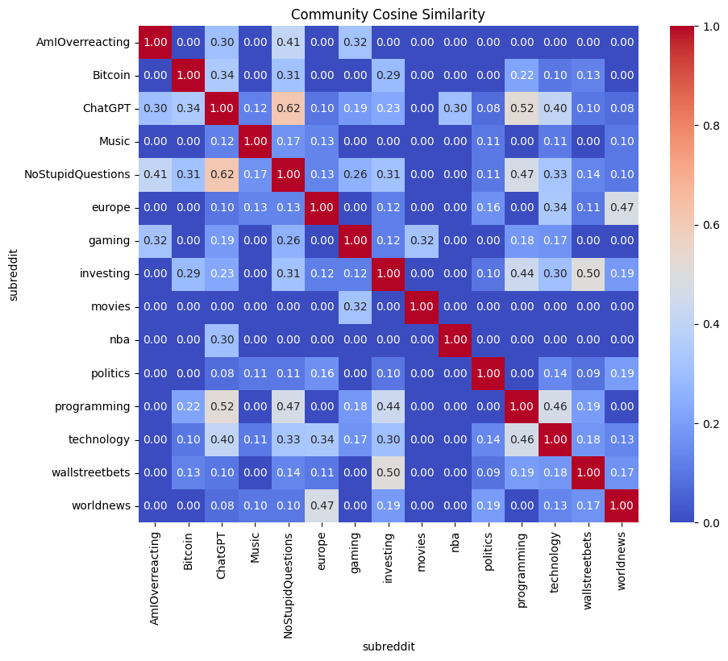

**Key observations:**
- The finance subreddits (r/wallstreetbets, r/investing, r/Bitcoin) cluster together with relatively high similarity scores.
- The news/politics subreddits (r/worldnews, r/politics, r/europe) also show high internal similarity.
- Entertainment subreddits (r/movies, r/gaming, r/nba, r/Music) tend to be more isolated, with lower similarity to other groups.
- The general/social subreddits (r/NoStupidQuestions, r/AmIOverreacting) show moderate similarity to many other communities, which makes sense given their broad topic coverage.
- r/ChatGPT shows interesting cross-domain connections, particularly with tech and finance communities, reflecting how AI/LLM topics have permeated multiple interest areas.

### Shared Topic Fraction Heatmap

This heatmap shows the fraction of topics shared between each pair of communities (number of shared topics / total distinct topics across both communities).

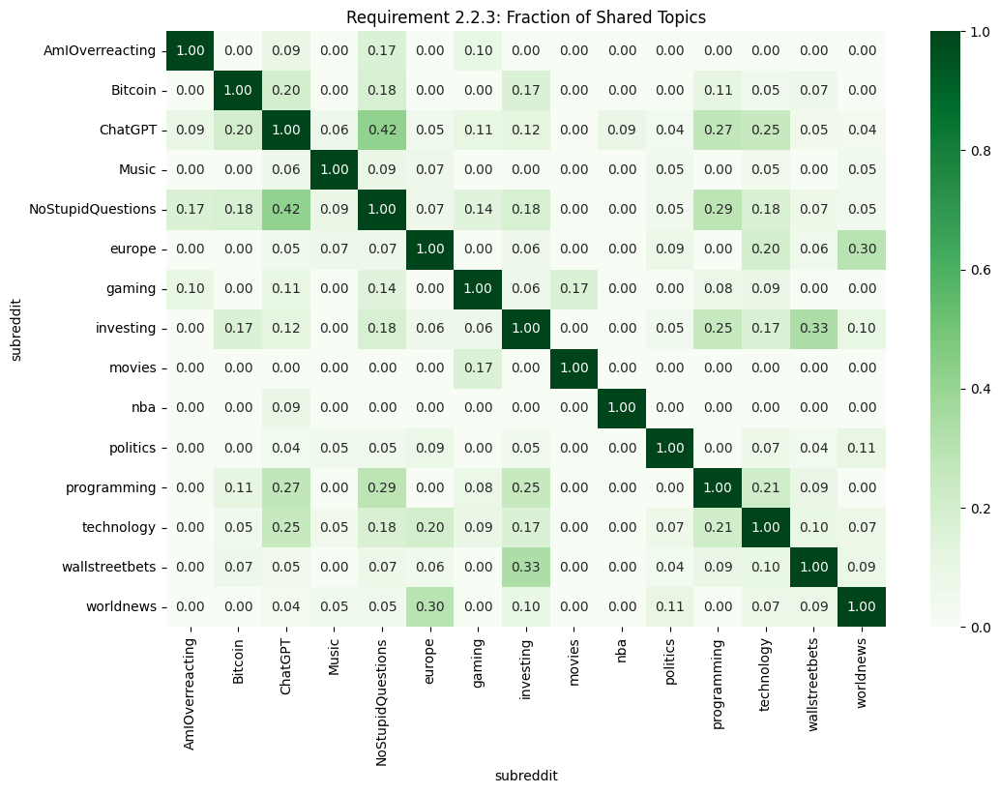

**Key observations:**
- Most topic overlap happens within the same interest category, confirming the intuition that communities in the same domain discuss similar things.
- Some cross-category connections exist, particularly around politically-charged topics like tariffs and trade policy, which show up in both politics/news and finance communities.
- r/Bitcoin is one of the most focused subreddits, sharing relatively few topics with communities outside the finance domain.
- General-purpose subreddits like r/NoStupidQuestions share topics with a wider range of communities, reflecting their broad scope.

### Community Density Analysis (UMAP)

To visualize the internal structure of communities, we re-embedded individual posts using `all-mpnet-base-v2`, reduced to 2D with UMAP, and colored each point by its assigned topic label. This gives us a visual sense of how tightly clustered or spread out the discussions are within each community.

**Most Heterogeneous Community:**

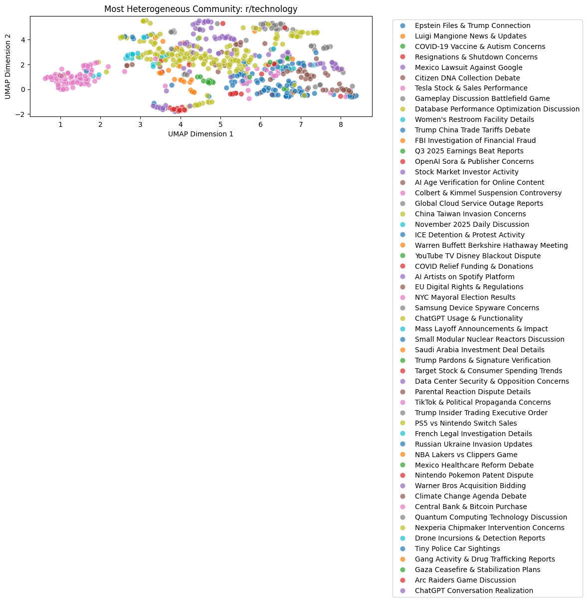

The most heterogeneous community (identified by having the highest number of distinct topics relative to post count) shows a widely spread distribution with many distinct clusters, each representing a different topic. This is characteristic of broad-interest subreddits where many different subjects come up.

**Most Homogeneous Community:**

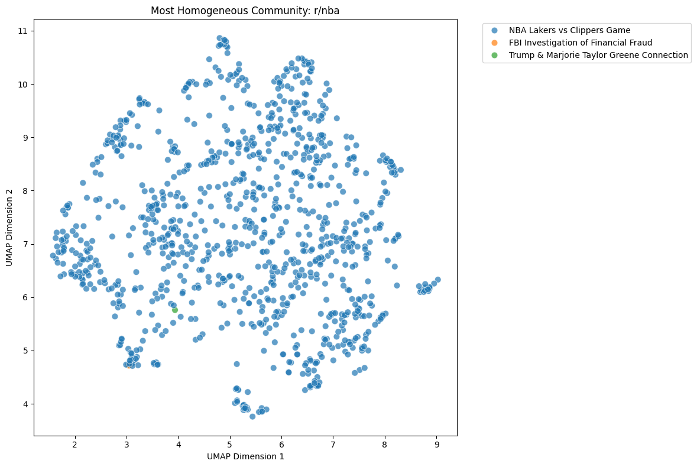

The most homogeneous community shows a much tighter distribution with fewer, more concentrated clusters. This is typical of highly focused subreddits (like r/Bitcoin or r/nba) where discussions naturally converge around a narrow set of topics.

### Word Clouds

We generated word clouds for each topic group using the LLM-refined labels. Each cloud visualizes the key terms associated with topics discovered by BERTopic, after being refined by Gemma 3 27B IT for readability.

<p align="center">
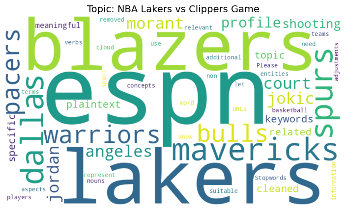
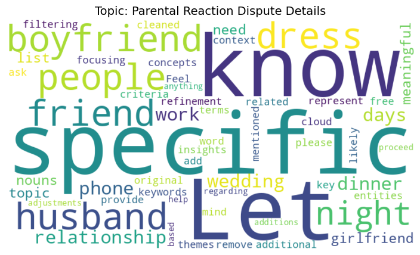
</p>
<p align="center">
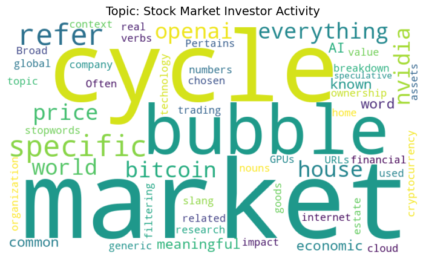
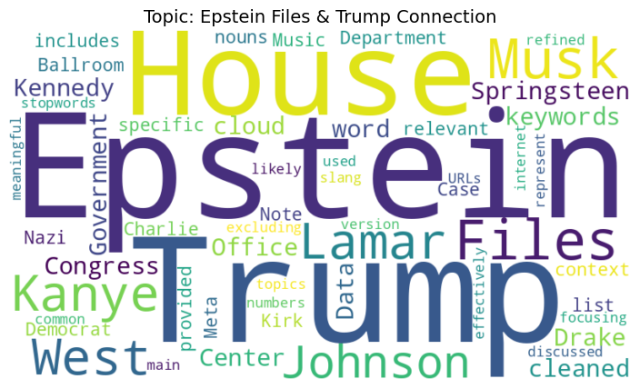
</p>
<p align="center">
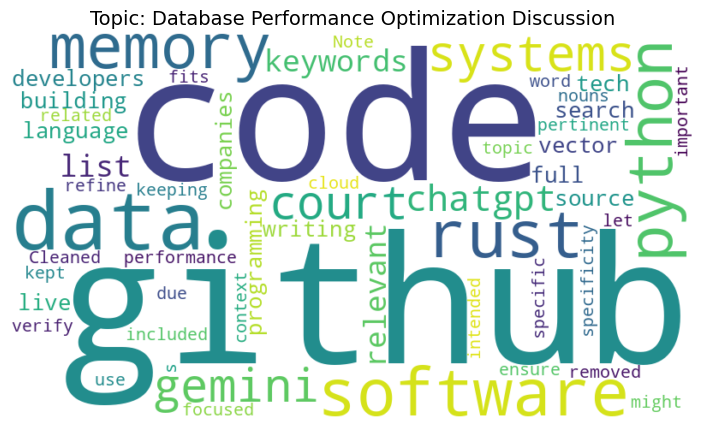
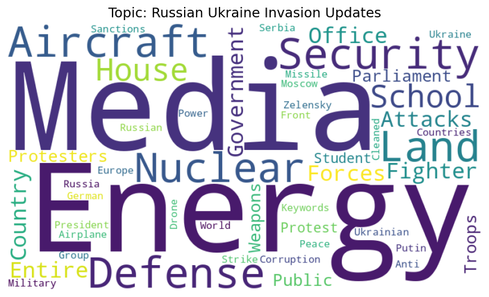
</p>
<p align="center">
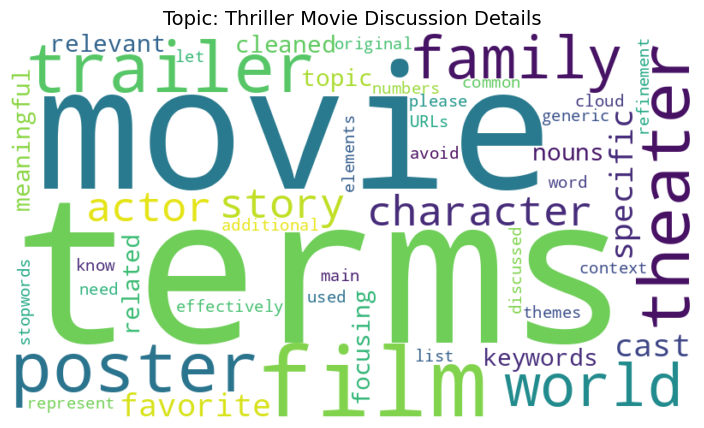
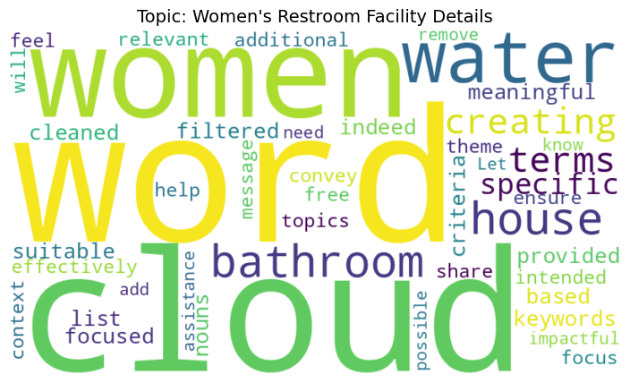
</p>
<p align="center">
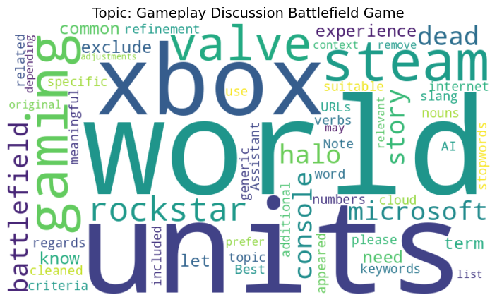
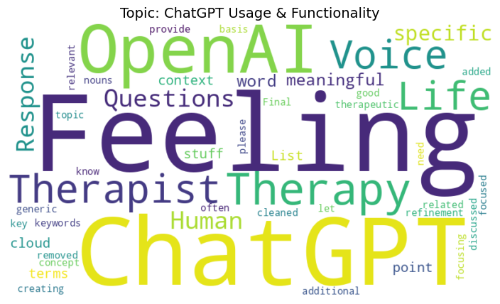
</p>

## Key Findings

1. **Narrow communities are more homogeneous.** Communities with narrow, well-defined purposes (r/Bitcoin, r/nba) tend to have fewer distinct topics and higher internal coherence. Their UMAP scatter plots show tight, concentrated clusters.

2. **Broad communities are heterogeneous.** General-purpose or broad communities (r/NoStupidQuestions, r/technology) are more heterogeneous, spreading across many topics. Their UMAP plots show widely dispersed point clouds with many small clusters.

3. **Within-domain overlap dominates.** Cross-community topic overlap happens most within the same domain. Finance subreddits share tariff/trade topics, news subreddits share geopolitics topics. This is visible in both the cosine similarity and shared topic fraction heatmaps.

4. **Some topics cross domain boundaries.** Politically-charged topics (like Trump-related policy discussions, tariffs, trade) appear in multiple unrelated categories, spanning politics, finance, and even tech communities.

5. **LLM labeling dramatically improves interpretability.** The LLM labeling step made the analysis significantly more interpretable compared to raw BERTopic output. Keyword-dump topic names like `"0_bitcoin_btc_crypto_mining"` are basically useless for cross-community comparison at a glance, while LLM-refined labels like `"Bitcoin Trading Daily Discussion"` make the topic matrices immediately readable.

6. **r/ChatGPT is a cross-domain connector.** The AI/LLM subreddit shows topic overlap with multiple domains (tech, finance, general), reflecting how AI discussions have become pervasive across interest areas.

## Setup

### Requirements

```
pip install -r requirements.txt
```

Main dependencies: `bertopic`, `sentence-transformers`, `umap-learn`, `hdbscan`, `pandas`, `numpy`, `scikit-learn`, `matplotlib`, `seaborn`, `google-genai`, `python-dotenv`, `torch`, `wordcloud`, `transformers`

### Environment Variables

Create a `.env` file in the project root:

```
Gemma_API_KEY="your_google_genai_api_key_here"
```

This is used by the topic analysis notebook to call the Gemma 3 27B IT model for topic label generation.

### Running

1. **Crawl data**: `python crawler.py` -- this takes a while due to rate limiting and sleep timers. It'll skip subreddits that already have data in `data_raw/`.
2. **Run topic modeling**: `python topic_modeling.py` -- needs a CUDA GPU for reasonable performance. Saves the model and outputs a CSV with topic assignments.
3. **Run analysis notebooks**: Open `topic_analysis.ipynb` and `data_visualizations_472.ipynb` in Jupyter. The topic analysis notebook does the LLM labeling, builds the binary matrix, computes similarity, and generates word clouds. The visualization notebook does the UMAP scatter plots.

### Reproducing Results

The saved BERTopic models and processed data files are not included in this repository due to size. To reproduce the full pipeline:

1. Run the crawler to collect data
2. Run the topic modeling script to generate embeddings and clusters
3. Run the analysis notebooks to produce all figures

All random seeds are fixed (`random_state=42` for UMAP) so results should be reproducible given the same input data.

